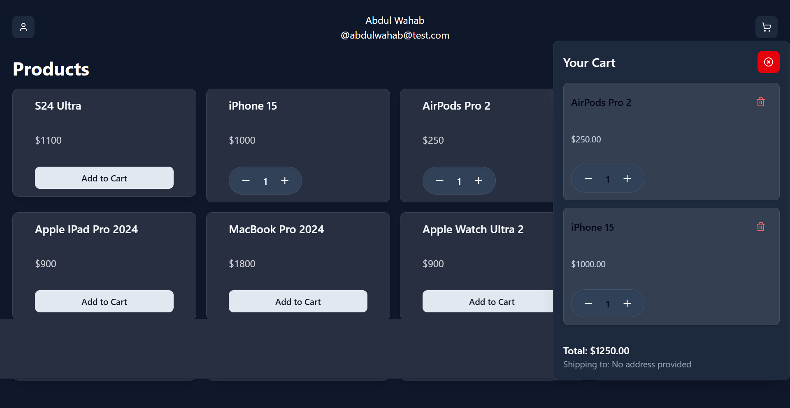

# 🛒 Zustand Shopping Cart

A clean and responsive shopping cart built with **React**, **Zustand** for state management, and **Tailwind CSS** for styling. Designed to be fast, minimal, and scalable for modern web applications.

---

## 🚀 Features

- 🧠 Global cart state with Zustand
- ➕ Add/remove items
- 🔢 Update item quantities
- 💰 Real-time cart total calculation
- 📱 Fully responsive design
- ♻️ Clean component structure and hooks

---

## 🛠️ Tech Stack

| Tech        | Description                                 |
|-------------|---------------------------------------------|
| React       | Frontend framework                          |
| Zustand     | Lightweight state management                |
| Tailwind CSS| Utility-first styling                       |
| Vite        | Fast development build tool *(optional)*    |
| TypeScript  | Type safety *(if used)*                     |

---

## 📦 Installation

```bash
git clone https://github.com/abdul-wahab619/zustand-shoppingcart.git
cd zustand-shoppingcart
npm install
npm run dev
```

---

## 🧩 Project Structure

```
src/
├── components/      # UI components
├── store/           # Zustand store logic
├── pages/ or App.tsx# Main layout and routing
├── utils/           # Helper functions
```


## 📸 Screenshots



---

## 📌 Future Improvements

- Product filtering/sorting
- LocalStorage or Zustand middleware for persistence
- User authentication
- Checkout flow integration

---

## 📄 License

MIT

## 🙌 Author

**Abdul Wahab**  
[GitHub](https://github.com/abdul-wahab619)
